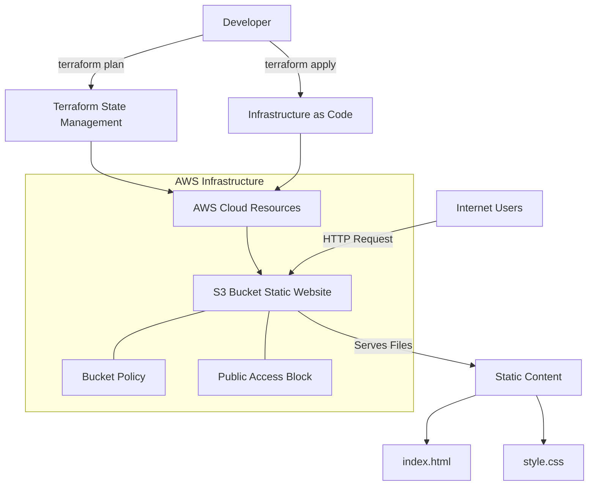

# Static Website Hosting using Terraform

<div style="display: flex; gap: 10px; align-items: center;">
  
  
  
  
</div>


<div align="center">
  <h3>🚀 Infrastructure as Code | ☁️ Cloud Hosting | 📱 Responsive Design</h3>
</div>

---

## Project Overview

This project demonstrates how to host a static website on AWS S3 using Terraform Infrastructure as Code (IaC). The project includes a professional resume website with modern CSS styling, deployed entirely through Terraform automation.

## Architecture

### High-Level Architecture Overview



### Detailed System Architecture

```
┌─────────────────────────────────────────────────────────────────────────────────┐
│                           TERRAFORM INFRASTRUCTURE WORKFLOW                      │
├─────────────────────────────────────────────────────────────────────────────────┤
│                                                                                 │
│  ┌─────────────┐    ┌─────────────────┐    ┌─────────────────┐    ┌───────────┐ │
│  │   Developer │───▶│  Terraform CLI  │───▶│   AWS Provider  │───▶│AWS Cloud  │ │
│  │             │    │                 │    │                 │    │Resources  │ │
│  │ • Plan      │    │ • State Mgmt    │    │ • Authentication│    │           │ │
│  │ • Apply     │    │ • Resource      │    │ • API Calls     │    │ • S3      │ │
│  │ • Destroy   │    │   Tracking      │    │ • Validation    │    │ • IAM     │ │
│  └─────────────┘    └─────────────────┘    └─────────────────┘    └───────────┘ │
│                                                                                 │
└─────────────────────────────────────────────────────────────────────────────────┘

┌─────────────────────────────────────────────────────────────────────────────────┐
│                            WEBSITE HOSTING ARCHITECTURE                         │
├─────────────────────────────────────────────────────────────────────────────────┤
│                                                                                 │
│  ┌─────────────┐    ┌─────────────────┐    ┌─────────────────┐    ┌───────────┐ │
│  │   End Users │───▶│   Internet      │───▶│   AWS S3 Bucket │───▶│  Website  │ │
│  │             │    │                 │    │   (Web Hosting) │    │   Files   │ │
│  │ • Web       │    │ • HTTP Request  │    │                 │    │           │ │
│  │   Browsers  │    │ • DNS           │    │ • Public Access │    │ • HTML    │ │
│  │ • Mobile    │    │   Resolution    │    │ • Static Host   │    │ • CSS     │ │
│  │   Devices   │    │                 │    │ • CORS Config   │    │ • Images  │ │
│  └─────────────┘    └─────────────────┘    └─────────────────┘    └───────────┘ │
│                                                     │                           │
│                                            ┌─────────────────┐                  │
│                                            │  Bucket Policy  │                  │
│                                            │                 │                  │
│                                            │ • Public Read   │                  │
│                                            │ • GetObject     │                  │
│                                            │ • Security      │                  │
│                                            └─────────────────┘                  │
│                                                                                 │
└─────────────────────────────────────────────────────────────────────────────────┘
```

### Component Architecture

```
┌─────────────────────────────────────────────────────────────────────────────────┐
│                               COMPONENT BREAKDOWN                               │
├─────────────────────────────────────────────────────────────────────────────────┤
│                                                                                 │
│  ┌─────────────────────────────────────────────────────────────────────────────┐ │
│  │                            TERRAFORM LAYER                                 │ │
│  ├─────────────────────────────────────────────────────────────────────────────┤ │
│  │                                                                             │ │
│  │  ┌─────────────┐  ┌─────────────┐  ┌─────────────┐  ┌─────────────────────┐ │ │
│  │  │ provider.tf │  │   main.tf   │  │ variables   │  │   State Files       │ │ │
│  │  │             │  │             │  │             │  │                     │ │ │
│  │  │ • AWS       │  │ • S3 Bucket │  │ • Regions   │  │ • terraform.tfstate │ │ │
│  │  │   Provider  │  │ • Policies  │  │ • Names     │  │ • .terraform/       │ │ │
│  │  │ • Region    │  │ • Website   │  │ • Tags      │  │ • Lock files        │ │ │
│  │  │   Config    │  │   Config    │  │             │  │                     │ │ │
│  │  └─────────────┘  └─────────────┘  └─────────────┘  └─────────────────────┘ │ │
│  │                                                                             │ │
│  └─────────────────────────────────────────────────────────────────────────────┘ │
│                                                                                 │
│  ┌─────────────────────────────────────────────────────────────────────────────┐ │
│  │                              AWS LAYER                                     │ │
│  ├─────────────────────────────────────────────────────────────────────────────┤ │
│  │                                                                             │ │
│  │  ┌─────────────┐  ┌─────────────┐  ┌─────────────┐  ┌─────────────────────┐ │ │
│  │  │ S3 Bucket   │  │   Bucket    │  │   Website   │  │   File Objects      │ │ │
│  │  │             │  │   Policy    │  │   Config    │  │                     │ │ │
│  │  │ • Storage   │  │             │  │             │  │ • index.html        │ │ │
│  │  │ • Naming    │  │ • Public    │  │ • Index Doc │  │ • style.css         │ │ │
│  │  │ • Region    │  │   Access    │  │ • Error Doc │  │ • Content-Type      │ │ │
│  │  │ • Tagging   │  │ • GetObject │  │ • CORS      │  │ • Permissions       │ │ │
│  │  └─────────────┘  └─────────────┘  └─────────────┘  └─────────────────────┘ │ │
│  │                                                                             │ │
│  └─────────────────────────────────────────────────────────────────────────────┘ │
│                                                                                 │
│  ┌─────────────────────────────────────────────────────────────────────────────┐ │
│  │                            WEBSITE LAYER                                   │ │
│  ├─────────────────────────────────────────────────────────────────────────────┤ │
│  │                                                                             │ │
│  │  ┌─────────────┐  ┌─────────────┐  ┌─────────────┐  ┌─────────────────────┐ │ │
│  │  │ HTML5       │  │    CSS3     │  │   Assets    │  │   Performance       │ │ │
│  │  │             │  │             │  │             │  │                     │ │ │
│  │  │ • Semantic  │  │ • Modern    │  │ • Fonts     │  │ • Minification      │ │ │
│  │  │   Markup    │  │   Styling   │  │ • Icons     │  │ • Compression       │ │ │
│  │  │ • SEO       │  │ • Responsive│  │ • Images    │  │ • Caching           │ │ │
│  │  │ • A11y      │  │ • Animations│  │ • Favicon   │  │ • CDN Ready         │ │ │
│  │  └─────────────┘  └─────────────┘  └─────────────┘  └─────────────────────┘ │ │
│  │                                                                             │ │
│  └─────────────────────────────────────────────────────────────────────────────┘ │
│                                                                                 │
└─────────────────────────────────────────────────────────────────────────────────┘
```

## Key Architecture Components

### 1. **Terraform Infrastructure as Code**
- **Provider Configuration**: Defines AWS provider and region settings
- **Resource Definitions**: Declarative infrastructure specifications
- **State Management**: Tracks resource state and changes
- **Dependency Management**: Handles resource creation order

### 2. **AWS S3 Static Website Hosting**
- **Storage Container**: S3 bucket for website files
- **Website Configuration**: Enables static website hosting features
- **Public Access**: Configured for public web access
- **Content Delivery**: Serves HTML, CSS, and assets

### 3. **Security & Access Control**
- **Bucket Policies**: JSON-based access control
- **Public Access Block**: Fine-grained public access settings
- **IAM Integration**: Role-based access management
- **CORS Configuration**: Cross-origin resource sharing

### 4. **Website Content Layer**
- **HTML5 Structure**: Semantic markup and modern standards
- **CSS3 Styling**: Modern layout and responsive design
- **Asset Management**: Optimized delivery of static resources
- **Performance Optimization**: Fast loading and caching

## Data Flow Architecture

```
┌─────────────────────────────────────────────────────────────────────────────────┐
│                                DATA FLOW                                        │
├─────────────────────────────────────────────────────────────────────────────────┤
│                                                                                 │
│  ┌─────────────┐                                                                │
│  │  Developer  │                                                                │
│  │   Machine   │                                                                │
│  └──────┬──────┘                                                                │
│         │                                                                       │
│         │ 1. terraform init                                                     │
│         │ 2. terraform plan                                                     │
│         │ 3. terraform apply                                                    │
│         │                                                                       │
│         ▼                                                                       │
│  ┌─────────────┐     ┌─────────────────┐     ┌─────────────────┐               │
│  │  Terraform  │────▶│   AWS API       │────▶│   S3 Service    │               │
│  │   Engine    │     │   Endpoints     │     │                 │               │
│  └─────────────┘     └─────────────────┘     └─────────────────┘               │
│         │                                               │                       │
│         │ State Updates                                 │ Resource Creation     │
│         │                                               │                       │
│         ▼                                               ▼                       │
│  ┌─────────────┐                                 ┌─────────────────┐           │
│  │  Local      │                                 │  S3 Bucket      │           │
│  │  State      │                                 │  Configuration  │           │
│  │  Files      │                                 │                 │           │
│  └─────────────┘                                 └─────────────────┘           │
│                                                           │                     │
│                                                           │ File Upload        │
│                                                           │                     │
│                                                           ▼                     │
│  ┌─────────────┐     ┌─────────────────┐     ┌─────────────────┐               │
│  │  End Users  │◀────│   Internet      │◀────│   Website       │               │
│  │  (Global)   │     │   (HTTP/HTTPS)  │     │   Content       │               │
│  └─────────────┘     └─────────────────┘     └─────────────────┘               │
│                                                                                 │
└─────────────────────────────────────────────────────────────────────────────────┘
```

## Network Architecture

```
┌─────────────────────────────────────────────────────────────────────────────────┐
│                              NETWORK FLOW                                       │
├─────────────────────────────────────────────────────────────────────────────────┤
│                                                                                 │
│  Internet (Global)                                                              │
│  ┌─────────────────────────────────────────────────────────────────────────────┐ │
│  │                                                                             │ │
│  │  ┌─────────────┐  ┌─────────────┐  ┌─────────────┐  ┌─────────────────────┐ │ │
│  │  │   Browser   │  │   Mobile    │  │   Crawler   │  │   API Clients       │ │ │
│  │  │             │  │   Apps      │  │             │  │                     │ │ │
│  │  │ • Chrome    │  │ • iOS       │  │ • Google    │  │ • Monitoring        │ │ │
│  │  │ • Firefox   │  │ • Android   │  │ • Bing      │  │ • Analytics         │ │ │
│  │  │ • Safari    │  │ • Tablets   │  │ • Social    │  │ • Performance       │ │ │
│  │  └─────────────┘  └─────────────┘  └─────────────┘  └─────────────────────┘ │ │
│  │                                                                             │ │
│  └─────────────────────────────────────────────────────────────────────────────┘ │
│                                        │                                         │
│                                        │ HTTP Requests                           │
│                                        │ (Port 80)                               │
│                                        │                                         │
│                                        ▼                                         │
│  AWS Global Infrastructure                                                       │
│  ┌─────────────────────────────────────────────────────────────────────────────┐ │
│  │                                                                             │ │
│  │  ┌─────────────┐  ┌─────────────┐  ┌─────────────┐  ┌─────────────────────┐ │ │
│  │  │   Route 53  │  │   CloudFront│  │   S3 Bucket │  │   Regional Edge     │ │ │
│  │  │   (Future)  │  │   (Future)  │  │   (Current) │  │   Locations         │ │ │
│  │  │             │  │             │  │             │  │                     │ │ │
│  │  │ • DNS       │  │ • CDN       │  │ • ap-south-1│  │ • Mumbai            │ │ │
│  │  │ • Health    │  │ • Caching   │  │ • Static    │  │ • Low Latency       │ │ │
│  │  │   Check     │  │ • SSL/TLS   │  │   Website   │  │ • High Availability │ │ │
│  │  └─────────────┘  └─────────────┘  └─────────────┘  └─────────────────────┘ │ │
│  │                                                                             │ │
│  └─────────────────────────────────────────────────────────────────────────────┘ │
│                                                                                 │
└─────────────────────────────────────────────────────────────────────────────────┘
```

## Security Architecture

```
┌─────────────────────────────────────────────────────────────────────────────────┐
│                             SECURITY LAYERS                                     │
├─────────────────────────────────────────────────────────────────────────────────┤
│                                                                                 │
│  ┌─────────────────────────────────────────────────────────────────────────────┐ │
│  │                           PERIMETER SECURITY                               │ │
│  ├─────────────────────────────────────────────────────────────────────────────┤ │
│  │                                                                             │ │
│  │  ┌─────────────┐  ┌─────────────┐  ┌─────────────┐  ┌─────────────────────┐ │ │
│  │  │  Internet   │  │   AWS WAF   │  │  CloudFront │  │   DDoS Protection   │ │ │
│  │  │  Traffic    │  │  (Future)   │  │  (Future)   │  │   (AWS Shield)      │ │ │
│  │  │             │  │             │  │             │  │                     │ │ │
│  │  │ • Global    │  │ • SQL Inj   │  │ • SSL/TLS   │  │ • Layer 3/4         │ │ │
│  │  │ • Filtered  │  │ • XSS       │  │ • HTTPS     │  │ • Auto Mitigation   │ │ │
│  │  │ • Monitored │  │ • Rate Limit│  │ • Headers   │  │ • Always On         │ │ │
│  │  └─────────────┘  └─────────────┘  └─────────────┘  └─────────────────────┘ │ │
│  │                                                                             │ │
│  └─────────────────────────────────────────────────────────────────────────────┘ │
│                                                                                 │
│  ┌─────────────────────────────────────────────────────────────────────────────┐ │
│  │                           SERVICE SECURITY                                 │ │
│  ├─────────────────────────────────────────────────────────────────────────────┤ │
│  │                                                                             │ │
│  │  ┌─────────────┐  ┌─────────────┐  ┌─────────────┐  ┌─────────────────────┐ │ │
│  │  │  S3 Bucket  │  │   Bucket    │  │   Public    │  │   Access Control    │ │ │
│  │  │  Security   │  │   Policy    │  │   Access    │  │   Lists             │ │ │
│  │  │             │  │             │  │   Block     │  │                     │ │ │
│  │  │ • Encryption│  │ • JSON      │  │             │  │ • IP Whitelist      │ │ │
│  │  │ • Versioning│  │ • Principal │  │ • Controlled│  │ • Geo Restriction   │ │ │
│  │  │ • Logging   │  │ • Resource  │  │ • Selective │  │ • Time-based        │ │ │
│  │  │ • MFA Delete│  │ • Action    │  │ • Audited   │  │ • Conditional       │ │ │
│  │  └─────────────┘  └─────────────┘  └─────────────┘  └─────────────────────┘ │ │
│  │                                                                             │ │
│  └─────────────────────────────────────────────────────────────────────────────┘ │
│                                                                                 │
│  ┌─────────────────────────────────────────────────────────────────────────────┐ │
│  │                           CONTENT SECURITY                                 │ │
│  ├─────────────────────────────────────────────────────────────────────────────┤ │
│  │                                                                             │ │
│  │  ┌─────────────┐  ┌─────────────┐  ┌─────────────┐  ┌─────────────────────┐ │ │
│  │  │  Static     │  │   Content   │  │   MIME      │  │   Security Headers  │ │ │
│  │  │  Content    │  │   Validation│  │   Types     │  │                     │ │ │
│  │  │  Security   │  │             │  │             │  │                     │ │ │
│  │  │             │  │ • File Size │  │ • text/html │  │ • X-Frame-Options   │ │ │
│  │  │ • No Server │  │ • File Type │  │ • text/css  │  │ • CSP               │ │ │
│  │  │ • No DB     │  │ • Malware   │  │ • image/*   │  │ • X-XSS-Protection  │ │ │
│  │  │ • No Code   │  │ • Scanning  │  │ • font/*    │  │ • HSTS (Future)     │ │ │
│  │  └─────────────┘  └─────────────┘  └─────────────┘  └─────────────────────┘ │ │
│  │                                                                             │ │
│  └─────────────────────────────────────────────────────────────────────────────┘ │
│                                                                                 │
└─────────────────────────────────────────────────────────────────────────────────┘
```

## Performance Architecture

```
┌─────────────────────────────────────────────────────────────────────────────────┐
│                            PERFORMANCE OPTIMIZATION                             │
├─────────────────────────────────────────────────────────────────────────────────┤
│                                                                                 │
│  ┌─────────────────────────────────────────────────────────────────────────────┐ │
│  │                           CONTENT DELIVERY                                 │ │
│  ├─────────────────────────────────────────────────────────────────────────────┤ │
│  │                                                                             │ │
│  │  ┌─────────────┐  ┌─────────────┐  ┌─────────────┐  ┌─────────────────────┐ │ │
│  │  │  S3 Origin  │  │   Transfer  │  │   Caching   │  │   Compression       │ │ │
│  │  │             │  │   Acceleration│  │   Strategy  │  │                     │ │ │
│  │  │ • Regional  │  │             │  │             │  │ • Gzip              │ │ │
│  │  │   Storage   │  │ • Multipart │  │ • Browser   │  │ • Brotli            │ │ │
│  │  │ • 99.999%   │  │ • Parallel  │  │ • Proxy     │  │ • Minification      │ │ │
│  │  │   Uptime    │  │ • Optimized │  │ • ETags     │  │ • Image Optimization│ │ │
│  │  └─────────────┘  └─────────────┘  └─────────────┘  └─────────────────────┘ │ │
│  │                                                                             │ │
│  └─────────────────────────────────────────────────────────────────────────────┘ │
│                                                                                 │
│  ┌─────────────────────────────────────────────────────────────────────────────┐ │
│  │                            FRONTEND PERFORMANCE                            │ │
│  ├─────────────────────────────────────────────────────────────────────────────┤ │
│  │                                                                             │ │
│  │  ┌─────────────┐  ┌─────────────┐  ┌─────────────┐  ┌─────────────────────┐ │ │
│  │  │  HTML       │  │    CSS      │  │   Images    │  │   Loading Strategy  │ │ │
│  │  │  Optimization│  │  Optimization│  │  Optimization│  │                     │ │ │
│  │  │             │  │             │  │             │  │                     │ │ │
│  │  │ • Semantic  │  │ • Critical  │  │ • WebP      │  │ • Critical Path     │ │ │
│  │  │ • Minified  │  │ • Inlined   │  │ • Lazy Load │  │ • Async Loading     │ │ │
│  │  │ • Structured│  │ • Deferred  │  │ • Responsive│  │ • Preload Hints     │ │ │
│  │  │ • Accessible│  │ • Optimized │  │ • Optimized │  │ • Service Workers   │ │ │
│  │  └─────────────┘  └─────────────┘  └─────────────┘  └─────────────────────┘ │ │
│  │                                                                             │ │
│  └─────────────────────────────────────────────────────────────────────────────┘ │
│                                                                                 │
└─────────────────────────────────────────────────────────────────────────────────┘
```

## Features

- **Infrastructure as Code**: Complete AWS infrastructure defined in Terraform
- **Automated Deployment**: Single command deployment of website and infrastructure
- **Public Access**: Properly configured S3 bucket policies for public web access
- **Modern Design**: Responsive resume website with professional styling
- **Cost Effective**: Serverless architecture with minimal AWS costs
- **High Availability**: AWS S3 provides 99.999999999% durability
- **Global Reach**: Ready for CDN integration and worldwide content delivery
- **Security**: Layered security approach with AWS best practices
- **Performance**: Optimized for fast loading and efficient content delivery
- **Scalability**: Auto-scaling capabilities built into AWS S3 service

## Architecture Benefits

### 🏗️ **Infrastructure as Code**
- **Reproducible**: Same infrastructure can be deployed across environments
- **Version Controlled**: All changes tracked in Git
- **Automated**: Reduces human error and deployment time
- **Documented**: Infrastructure is self-documenting through code

### ☁️ **Cloud-Native Design**
- **Serverless**: No servers to manage or maintain
- **Auto-scaling**: Handles traffic spikes automatically
- **Pay-as-you-go**: Cost scales with actual usage
- **Global Infrastructure**: Built on AWS global network

### 🔒 **Security First**
- **Least Privilege**: Only necessary permissions granted
- **Encryption**: Data encrypted at rest and in transit
- **Access Control**: Fine-grained access policies
- **Monitoring**: Built-in logging and monitoring capabilities

### ⚡ **Performance Optimized**
- **Edge Locations**: Ready for CDN integration
- **Optimized Content**: Minified and compressed assets
- **Caching**: Browser and proxy caching strategies
- **Fast Loading**: Optimized for Core Web Vitals

This architecture provides a solid foundation for hosting static websites with modern DevOps practices, security best practices, and performance optimization techniques.
